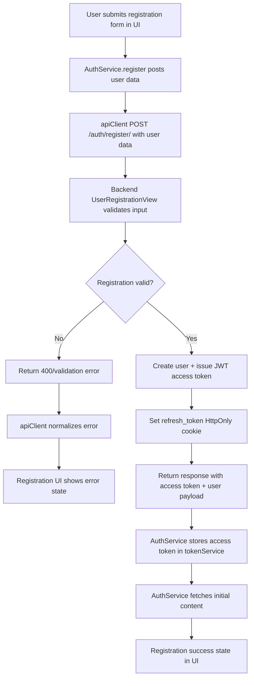
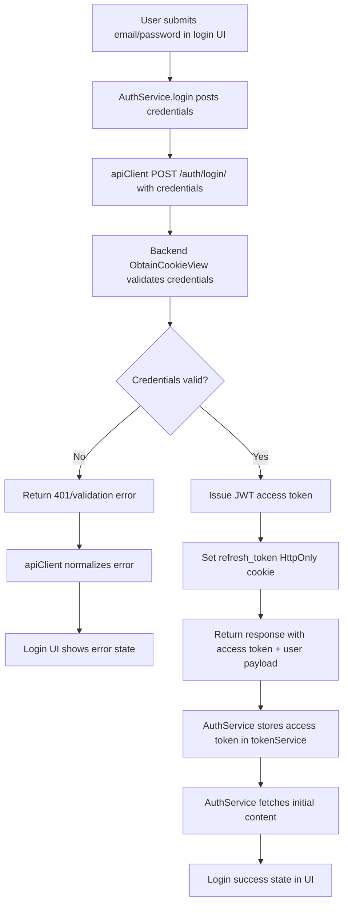
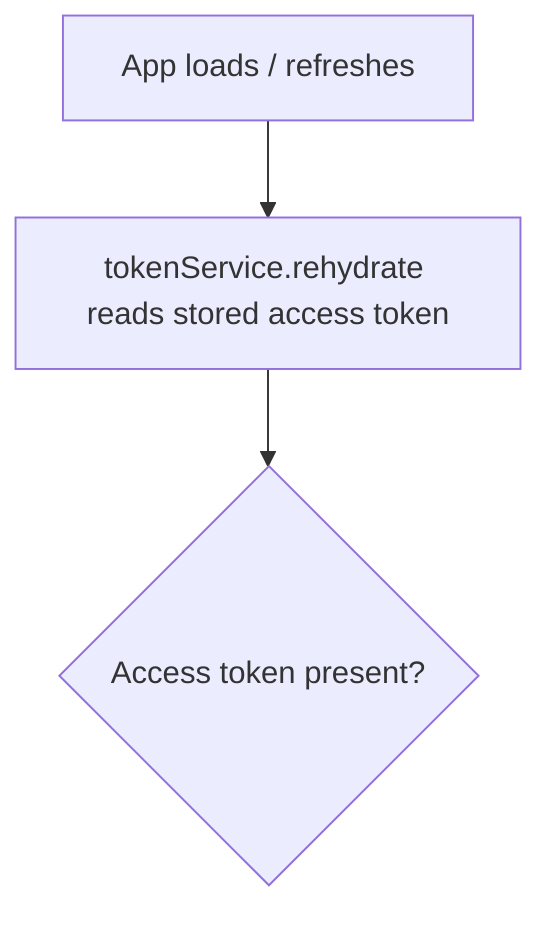

# Registration Flowchart (Client ⇄ Server ⇄ Client)

## Key Components

- **Frontend**
  - `AuthService.register` sends the registration request, stores the access token, and triggers initial content fetches success.
  - `apiClient` configures Axios with credentials and handles responses/errors.
- **Backend**
  - `UserRegistrationView` validates input, creates the user, issues the access token, and sets the refresh token as an HttpOnly cookie.

## Notes

- Refresh tokens are stored as HttpOnly cookies and scoped to `/api/v2/auth/`.
- Access tokens are kept client-side in the token service and attached to future API requests.

# Login Flowchart (Client ⇄ Server ⇄ Client)

## Key Components

- **Frontend**
  - `AuthService.login` sends the login request, stores the access token, and triggers initial content fetches after success.
  - `apiClient` configures Axios with credentials and handles responses/errors.
- **Backend**
  - `ObtainTokenCookieView` validates credentials, issues the access token, and sets the refresh token as an HttpOnly cookie.

## Notes

- Refresh tokens are stored as HttpOnly cookies and scoped to `/api/v2/auth/`.
- Access tokens are kept client-side in the token service and attached to future API requests.

# Auth Persistence Flowchart (Client ⇄ Server ⇄ Client)

